# D208 Performance Assessment — Task 2: Logistic Regression Modeling

*Original coursework for D208 – Predictive Modeling, Western Governors University.*

## Part I: Research Question

**A1. What factors correlate with churn?**

**A2. Goals of the data analysis**
The purpose of my analysis is to gain further insight to determine what customer factors have a significant correlation with customer churn. The gaming and telecommunication fields have services with mass competition resulting in a fast cycle of customer inflow and churn (Ahn et al.). Making it a KPI (Key Performance Indicator) and particularly important data point for a business data analyst.

## Part II: Method Justification

**B1. Assumptions**
When using logistic regression to build models, it is assumed that:
- The response (dependent) variable must be categorical, and the explanatory (independent) variables can be continuous and/or categorical
- The independent variables are not highly correlated
- The observations are independent and random
- The relationship between the independent variables and the log-odds of the outcome should be linear

**B2. Programming language and Benefits**
For this analysis I will be using RStudio, given that we'll be building a statistical model and RStudio is very efficient at it. RStudio offers many packages that we'll need to create a logistic regression model like dplyr, visdat, tidyr, ggplot2, and readr. After loading the data using readr, I'll be using visdat to find missing values with the vis_miss function. The dplyr package will be helpful when mutating and selecting columns throughout the analysis, tidyr for gathering columns into key-value pairs, dummyVars for transforming categorical variables into "dummy" variables. Lastly, I'll be using ggplot2 for plotting the distribution of variables.

**B3. Justification for Logistic Regression**
Our analysis goal is to gauge what customer factors have a significant relationship with their churn value. In this case the response variable, Churn, is a categorical variable therefore Logistic Regression is the best approach, and the dataset provides various categorical and continuous variables to choose from as explanatory variables.

## Part III: Data Preparation

**C1. Data Cleaning**
I plan on using the duplicated(df) function from base R to identify if there are any duplicated rows in the data frame. This function determines which elements of a vector or data frame are duplicates of elements with smaller subscripts and returns a logical vector showing which elements (rows) are duplicates with True and False if not a duplicated row (Rdocumentation, accessed 2024). I also plan on applying the sum(duplicated(df)) function included with base R as well. This will sum() any True elements in the duplicated() output vector so it will help us answer how many duplicated rows there are in the data frame. The easiest way to detect missing values in R is using the colSums(is.na(df)) function (native to base R) which tallies up the count of missing values per column. I then plan on using the vis_miss(df) function from the library(visdat) to build a visualization of the missing values by column and provides the sparsity percentages of missing vs. non-missing values in the total data as well as per column. Finally, I plan on using the boxplot method to identify any outliers in the quantitative columns using the boxplot() function already included in R. This method will give me the minimum and maximum whiskers of each numerical column to better assess the quality of the values in the columns and the best method of treatment. See [`churn_logistic_regression.R`](./churn_logistic_regression.R) for the full code.

**C2. Data Exploration**
To answer my logistic analysis of which factors correlate to Churn I will be using Churn as my dependent categorical variable. As for my independent variables, I will be using a total of 9 columns, 12,17:19,26,39:42, which include the columns listed below. I will describe each of the quantitative variables using their summary statistics. The summary statistics include the minimum and max values as well as the mean which is the average value for the column. The statistics also include the 1st and 3rd quartile values which lets us know the values in a data set that indicate the 25th and 75th percentiles, respectively. Lastly, the median will also be included which represents the midpoint value of the dataset. Since I have not yet performed any data wrangling all of the categorical variables remain the same and therefore, I cannot view their summary statistics. Instead, I use a table to summarize the categorical variables based on the number of observations included in the dataset. The pivot_longer function from the tidyr package will gather the categorical columns into key-value pairs. This will enable me to plot the distribution of each variable more easily.

- Area:
  - Rural – 33.27%
  - Suburban – 33.46%
  - Urban – 33.27%
- Income: See summary statistics below.
- Marital:
  - Divorced – 20.92%
  - Married – 19.11%
  - Never Married – 19.56%
  - Separated – 20.14%
  - Widowed – 20.27%
- Gender:
  - Female – 50.25%
  - Male – 47.44%
  - Nonbinary – 2.31%
- Churn:
  - No – 73.50%
  - Yes – 26.50%
- Contract:
  - Month-to-month – 54.56%
  - One year – 21.02%
  - Two Year – 24.42%
- PaymentMethod:
  - Bank Transfer(automatic) – 22.29%
  - Credit Card(automatic) – 20.83%
  - Electronic Check – 33.98%
  - Mailed Check – 22.90%
- Tenure: See summary statistics below.
- MonthlyCharge: See summary statistics below.
- Bandwidth_GB_Year: See summary statistics below.

```
   Area              Income        Marital           Gender          Churn
 Length:8993     Min.   :  348.7  Length:8993     Length:8993     Length:8993
 Class:character  1st Qu.:17947.5 Class:character Class:character Class:character
 Mode :character  Median :30090.2 Mode :character Mode :character Mode :character
                   Mean   :33084.8
                   3rd Qu.:46431.1
                   Max.   :78273.0

   Contract         PaymentMethod        Tenure       MonthlyCharge   Bandwidth_GB_Year
 Length:8993      Length:8993        Min.   : 1.000   Min.   : 79.98  Min.   : 155.5
 Class:character  Class:character    1st Qu.: 7.874   1st Qu.:139.98  1st Qu.:1230.9
 Mode :character  Mode :character    Median :31.441   Median :169.94  Median :3185.8
                                      Mean   :34.466   Mean   :172.95  Mean   :3388.2
                                      3rd Qu.:61.495   3rd Qu.:202.44  3rd Qu.:5590.6
                                      Max.   :71.999   Max.   :290.16  Max.   :7159.0
```

**C3. Visualizations**
Univariate bar charts for `Area`, `Marital`, `Gender`, `Churn`, `Contract`, and `PaymentMethod`; boxplots for `Income`, `Tenure`, `MonthlyCharge`, and `Bandwidth_GB_Year`; and stacked bivariate bar charts of each categorical predictor against `Churn`. Running [`churn_logistic_regression.R`](./churn_logistic_regression.R) regenerates all of these plots.

Univariate
- Area
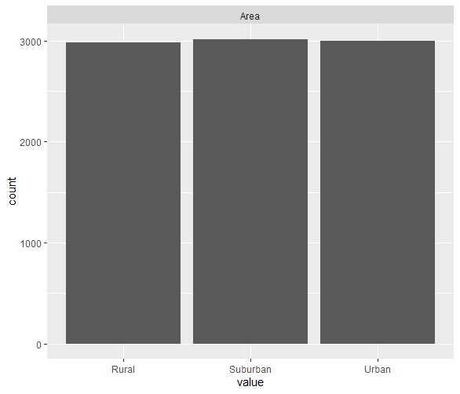
- Income
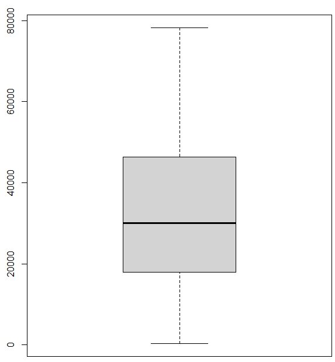
- Marital
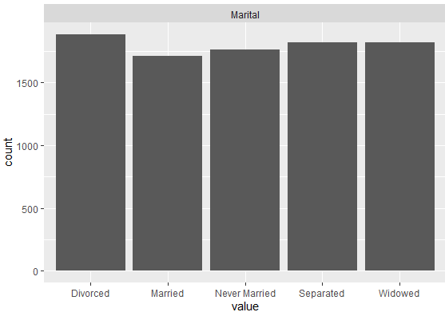
- Gender
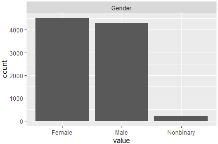
- Churn
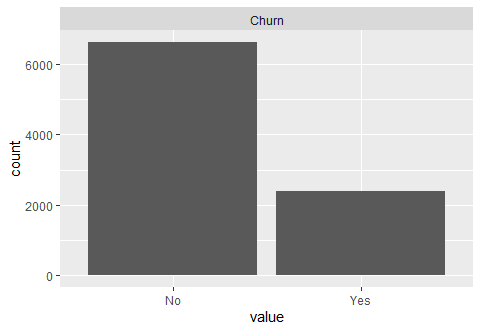
- Contract
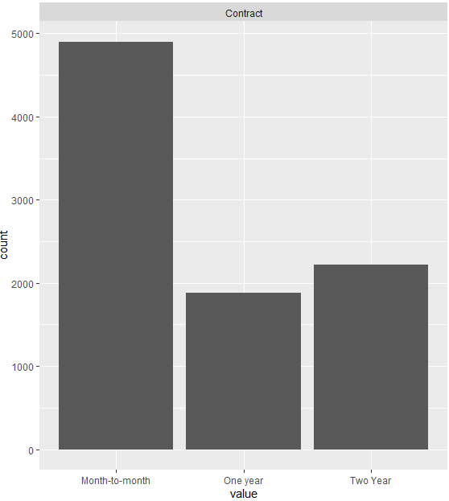
- PaymentMethod
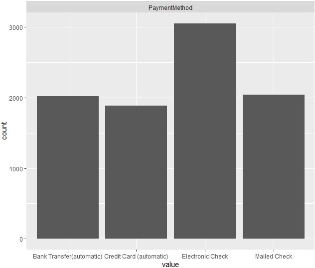
- Tenure
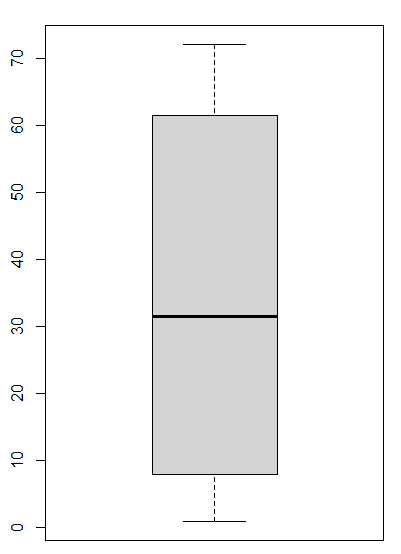
- MonthlyCharge
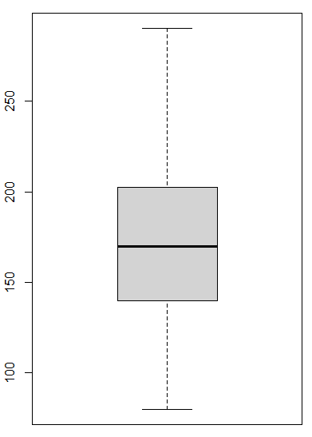
- Bandwidth_GB_Year
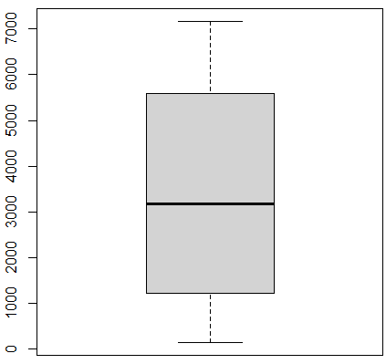

Bivariate
- Area
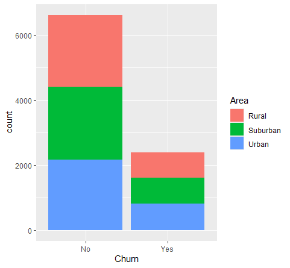
- Income
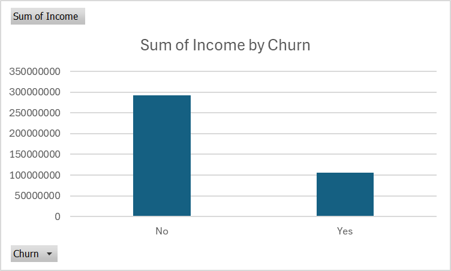
- Marital
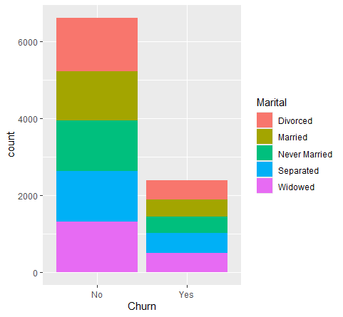
- Gender
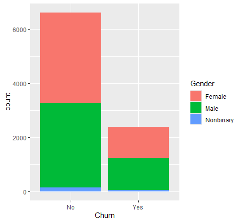
- Contract
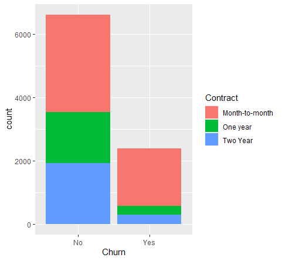
- PaymentMethod
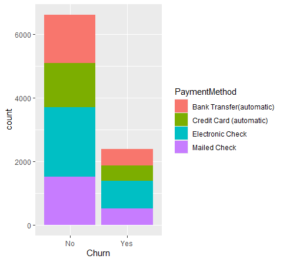
- Tenure
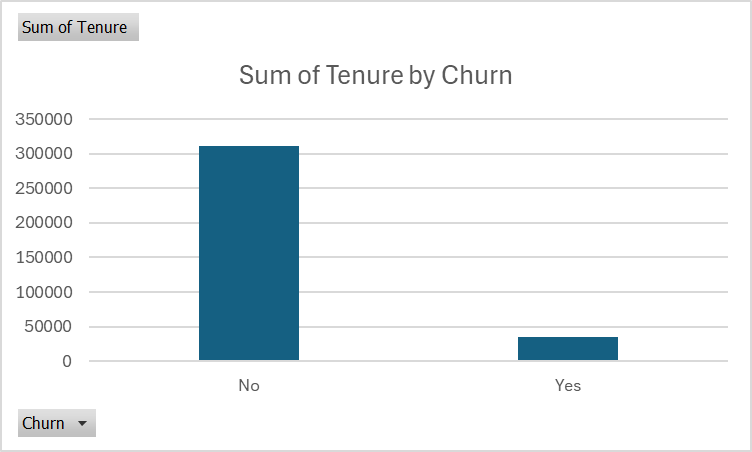
- MonthlyCharge
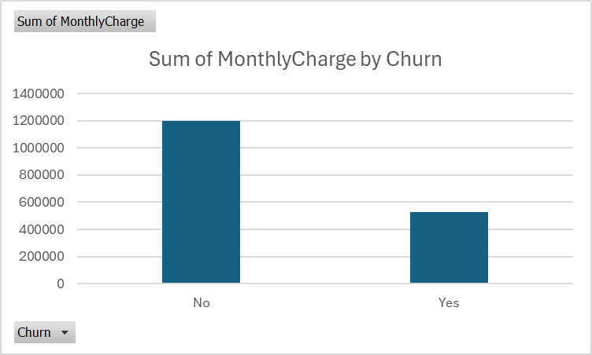
- Bandwidth_GB_Year
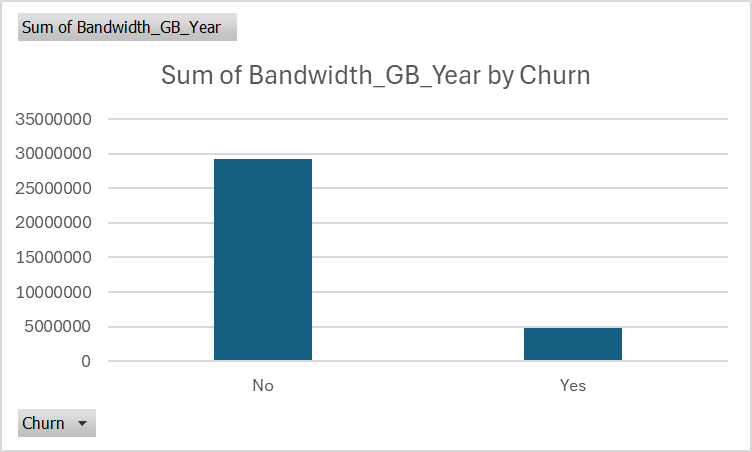

**C4. Data Transformation (Wrangling)**
For the binary categorical variables, I will use the dummy coding method by mutating the values of 'Yes' to 1 and 'No' to 0. This will help mitigate multicollinearity and enable us to apply the glm function. For the same reason, the ChurnNo dummy variable will also be removed, otherwise it will create a perfect separation with our independent variable, ChurnYes. Lastly, columns with undefined coefficients will also be removed to prevent any multicollinearity.

**C5. Prepare Dataset**
See [`PreparedDatasetTask2.csv`](./PreparedDatasetTask2.csv) (regenerated by the script above).

## Part IV: Model Comparison and Analysis

**D1. Initial Model**
```r
churn_mod_initial <- glm(formula = ChurnYes ~ ., family = binomial, data = model_data_final)
```
PLEASE NOTE: the ChurnNo column was removed to prevent complete separation, as well as the variables with undefined coefficients (AreaUrban, MaritalWidowed, GenderNonbinary, ContractTwo.Year, PaymentMethodMailed.Check).
```
Coefficients:
                                        Estimate Std. Error z value Pr(>|z|)    
(Intercept)                           -9.273e+00  3.896e-01 -23.800  < 2e-16 ***
AreaRural                             -7.849e-03  9.366e-02  -0.084  0.93321    
AreaSuburban                          -5.021e-02  9.295e-02  -0.540  0.58905    
Income                                -2.636e-06  2.024e-06  -1.302  0.19283    
MaritalDivorced                       -3.399e-01  1.187e-01  -2.863  0.00419 ** 
MaritalMarried                        -2.826e-01  1.220e-01  -2.317  0.02050 *  
MaritalNever.Married                  -3.968e-01  1.208e-01  -3.284  0.00102 ** 
MaritalSeparated                      -1.956e-01  1.192e-01  -1.641  0.10075    
GenderFemale                           2.716e-01  2.651e-01   1.024  0.30565    
GenderMale                             2.710e-01  2.654e-01   1.021  0.30733    
ContractMonth.to.month                 3.106e+00  1.201e-01  25.857  < 2e-16 ***
ContractOne.year                       1.231e-01  1.344e-01   0.916  0.35971    
PaymentMethodBank.Transfer.automatic. -2.113e-01  1.148e-01  -1.840  0.06573 .  
PaymentMethodCredit.Card..automatic.   2.299e-02  1.171e-01   0.196  0.84444    
PaymentMethodElectronic.Check          3.314e-01  1.047e-01   3.165  0.00155 ** 
Tenure                                -3.854e-01  1.522e-02 -25.317  < 2e-16 ***
MonthlyCharge                          3.677e-02  1.262e-03  29.140  < 2e-16 ***
Bandwidth_GB_Year                      3.435e-03  1.703e-04  20.166  < 2e-16 ***
---
(Dispersion parameter for binomial family taken to be 1)
Null deviance: 10393.5  on 8992  degrees of freedom
Residual deviance:  4378.5  on 8975  degrees of freedom
AIC: 4414.5
```

**D2. Model Reduction Method and Justification**
The initial model summary showed that the variables AreaUrban, MaritalWidowed, GenderNonbinary, ContractTwo.Year, PaymentMethodMailed.Check have undefined coefficients due to their multicollinearity with independent variables. After omitting the NA values, the backward stepwise elimination model reduction method is applied to the rest of the variables starting with AreaRural the least significant. Based on their p value, one variable at a time will be removed until no improvement is observed or no variable has a p value greater than 0.05. I'm using this wrapper method because our dataset is relatively small so the computing power won't be a problem and I chose this wrapper method over the recursive feature elimination because it has clear interpretability.

**D3. Reduced Model**
```r
churn_mod <- glm(formula = ChurnYes ~ ., family = binomial, data = final_data_set)
```
```
Coefficients:
                                        Estimate Std. Error z value Pr(>|z|)    
(Intercept)                            -9.2096681  0.2586523 -35.606  < 2e-16 ***
MaritalNever.Married                   -0.1967589  0.0968347  -2.032  0.042163 *  
ContractMonth.to.month                  3.0315357  0.0999315  30.336  < 2e-16 ***
PaymentMethodBank.Transfer.automatic.  -0.2119594  0.0994793  -2.131  0.033115 *  
PaymentMethodElectronic.Check           0.3223500  0.0875267   3.683  0.000231 ***
Tenure                                 -0.3834977  0.0150769 -25.436  < 2e-16 ***
MonthlyCharge                           0.0366679  0.0012557  29.202  < 2e-16 ***
Bandwidth_GB_Year                       0.0034137  0.0001686  20.249  < 2e-16 ***
---
(Dispersion parameter for binomial family taken to be 1)
Null deviance: 10393.5  on 8992  degrees of freedom
Residual deviance:  4391.7  on 8985  degrees of freedom
AIC: 4407.7
```

**E1. Model Comparison**
After using the backward stepwise elimination model reduction method the initial regression equation was reduced from 22 independent variables to just 7. The 'features' with a p value greater than 0.05 were all removed. Step7 in the backward elimination produced the model with the lowest AIC value but still had an independent variable with a p value > 0.05, Marital.Separated, p value = 0.11263. Step 10 produced the best reduced model with independent variables all having a p value less than 0.05, making them statistically meaningful. The Akaike's Information Criteria is used for model selection because it penalizes the errors made in case a new variable is added to the regression equation, meaning the model with the lowest AIC value is the best fit. According to the results the best-fit model was produced by the reduced model, the original model has an AIC value of 4414.5 while the reduced model has the lower AIC value of 4407.7.

**E2. Confusion Matrix and Accuracy Calculation**

*Confusion Matrix*
```r
churn.prob <- predict(churn_mod, type="response")
churn.pred <- ifelse(churn.prob > 0.5, "Yes", "No")
conf_matrix <- table(churn_data_df$Churn, churn.pred)
conf_matrix
```
```
        churn.pred
          No  Yes
  No    6173  440
  Yes    548 1832
```

*Accuracy calculation*
The model's accuracy is the number of samples correctly classified out of all the samples present in the test set. To calculate the accuracy of the model we can use the following accuracy equation:

Accuracy = (TP + TN) / (TP + FP + TN + FN)

89% = (1832 + 6173) / (1832 + 440 + 6173 + 548) · 100%

**E3. Code**
See [`churn_logistic_regression.R`](./churn_logistic_regression.R).

## Part V: Data Summary and Implications

**F1. Regression Equation, Coefficients, etc.**
Regression equation for reduced model:

ln(p / (1 − p)) = −9.2096681 − 0.1967589(MaritalNever.Married) + 3.0315357(ContractMonth.to.month) − 0.2119594(PaymentMethodBank.Transfer.automatic.) + 0.3223500(PaymentMethodElectronic.Check) − 0.3834977(Tenure) + 0.0366679(MonthlyCharge) + 0.0034137(Bandwidth_GB_Year)

Our regression equation has seven explanatory variables: MaritalNever.Married, ContractMonth.to.month, PaymentMethodBank.Transfer.automatic., PaymentMethodElectronic.Check, Tenure, MonthlyCharge, and Bandwidth_GB_Year.

The categorical variables marital status, contract, and payment method are represented by 'dummy' variables to represent which values of the variables have a statistically significant relationship with the response variable Churn. The independent variables with the most significant p values are ContractMonth.to.month, PaymentMethodElectronic.Check, Tenure, MonthlyCharge, and Bandwidth_GB_Year. Holding all other variables constant, ContractMonth.to.month being 1 ("Yes") causes the natural log odds of the customer churning ("ChurnYes" = 1) to increase by 3.0315357. Holding all other variables constant, PaymentMethodElectronic.Check being 1 ("Yes") causes the natural log odds of the customer churning ("ChurnYes" = 1) to increase by 0.3223500. Holding all other variables constant, one unit change in Tenure causes the natural log odds of the customer churning ("ChurnYes" = 1) to change by -0.3834977. Holding all other variables constant, one unit change in MonthlyCharge causes the natural log odds of the customer churning ("ChurnYes" = 1) to increase by 0.0366679. Holding all other variables constant, one unit change in Bandwidth_GB_Year causes the natural log odds of the customer churning ("ChurnYes" = 1) to increase by 0.0034137.

Statistically speaking our reduced model correctly classified 89% of all the samples present in the data set and had the lowest AIC value when compared to the initial model. This makes the model more accurate and reliable to predict whether a customer churned in the data set. With this being said, practically speaking it would make sense that customers who are on a month-to-month contract are more likely to have churned since they can cancel any month without penalty. In the same token it also makes sense that customers who use electronic checks churned since they're not on an automatic drafting schedule, their services can be canceled for lapse in payment unlike the automatic Bank Transfer customers who have a negative relationship with the dependent variable, ChurnYes. Tenure showing a negative correlation with churn is a positive thing because it means the longer a customer stays with the company the less likely they are to have churned. Lastly, the last 2 most significant variables MonthlyCharge and Bandwidth_GB_Year having a positive correlation with churn odds makes sense because higher payments pose a financial hurdle for most, and those who use internet services extensively require fast speeds that the company is unable to offer to all customers.

The methods used in this analysis include many implications from the data preparation steps to the model reduction step. During the data cleaning step, I used the imputation method which means there are some risks of data distortion as well as distribution distortion. The level of difficulty also increases with more instances and predictor variables. The three methods I used on my outliers were imputation, retention, and exclusion. Some of the cons of imputation include the cause of bias since it uses guesstimated values. While retention decreases normality for statistical tests it is best used for values that are expected like the GPS coordinates. Exclusion will reduce the sample size but provide flexibility for analysis. During the data wrangling step I used the dummyVars function which can increase the model's complexity by adding parameters, potential for multicollinearity when dealing with many categories, difficulty interpreting coefficients due to reliance on a reference category, overfitting when too many dummy variables are used, and limited ability to capture nuanced differences within categories of a categorical variable, especially if the categories are ordinal. Lastly, I used the backward stepwise elimination method to reduce my model which has the potential for instability in variable selection, biased parameter estimates, overfitting to the data, not considering all possible variable combinations, and the risk of excluding important variables due to their seemingly insignificant relationship with the dependent variable, especially when there is high collinearity among predictors.

**F2. Recommendations**
In conclusion, our logistic regression model suggests that customers who are on a month-to-month contract, pay with electronic checks and have a high monthly charge and/or bandwidth usage per year are more likely to churn. With this being said, the longer the customer stays with the company the more likely they are to not churn. This is huge because it speaks to the customer loyalty and service of the company, which is headed in the right direction. I would recommend the company reaches out to customers who are on a month-to-month contract and encourage them to sign up for a longer-term contract by perhaps offering a special discount for signing up for a longer-term contract. Offering a discount for choosing automatic Bank Transfer could also lower the likelihood of a customer churning since this payment method showed a negative correlation with ChurnYes as well. Both of these promotional offers could improve the odds of customer churn and as stated in the goal of this analysis customer churn can be very costly to companies so preventing this is key.

## Part VI: Demonstration

**G. Panopto Video**
https://wgu.hosted.panopto.com/Panopto/Pages/Viewer.aspx?id=92250264-a7df-4b7a-88c2-b27f0006ec6f

**H. Web Sources for code**
- Tierney, N. (2023, February 2). Preliminary visualisation of data [R package visdat version 0.6.0]. The Comprehensive R Archive Network. https://cran.r-project.org/package=visdat
- Home. RDocumentation. (n.d.-b). https://www.rdocumentation.org/
- Tierney, N. (2023b, February 2). Using visdat. Using Visdat. https://cran.r-project.org/web/packages/visdat/vignettes/using_visdat.html
- Data Tricks. (2021, December 10). One-hot encoding in R: Three simple methods. https://datatricks.co.uk/one-hot-encoding-in-r-three-simple-methods
- Bobbitt, Z. (2021, April 22). How to create a residual plot in R. Statology. https://www.statology.org/residual-plot-r/

**I. Sources for content**
- Ahn, J., Hwang, D., Kim, H., Choi, and S. Kang, A Survey on Churn Analysis in Various Business Domains. in IEEE Access, vol. 8, pp. 220816-220839, 2020, doi:10.1109/ACCESS.2020.3042657.
- Osborne, Jason & Elaine Waters (2002). Four assumptions of multiple regression that researchers should always test. *Practical Assessment, Research & Evaluation, 8*(2). http://PAREonline.net/getvn.asp?v=8&n=2
- WGU INFORMATION TECHNOLOGY. (2023, August 8). R or python. Western Governors University. https://www.wgu.edu/online-it-degrees/programming-languages/r-or-python.html
- Residual plots and assumption checking - statsnotebook - simple. powerful. reproducible. StatsNotebook. (2020, October 16). https://statsnotebook.io/blog/analysis/linearity_homoscedasticity/
